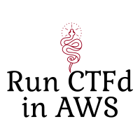
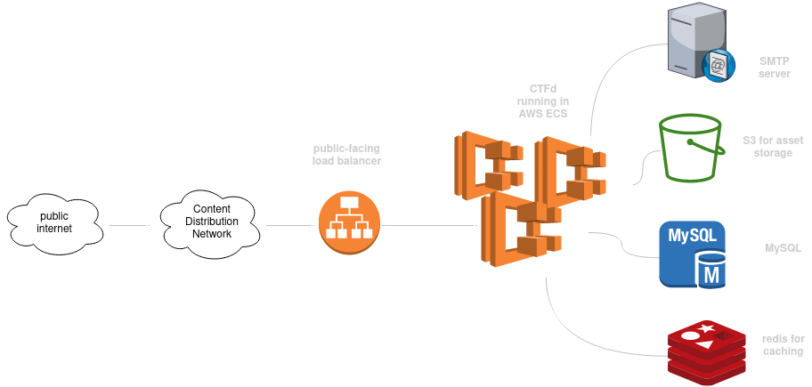

# CTFd on AWS




Build yourself some serverless infra to run [`ctfd`](https://github.com/CTFd/CTFd/) in AWS.

## Requirements

- [`terraform`](https://www.terraform.io/) (this was built and tested with v1.2.2)
- Existing VPC and subnet IDs for AWS resources (see the [Usage](#usage) section for examples)
- SMTP server and credentials, such as [AWS SES](https://docs.aws.amazon.com/ses/latest/DeveloperGuide/send-email-smtp.html) or [Mailgun](https://www.mailgun.com/)
- Wildcard certificate managed by [AWS Certificate Manager](https://aws.amazon.com/certificate-manager/)

## Things To Know

- Secrets are expected to be stored in [SSM Parameter Store](https://docs.aws.amazon.com/systems-manager/latest/userguide/systems-manager-parameter-store.html) under the path `/ctfd/` (or under `/$NAME_OVERRIDE-ctfd/` if setting that variable).

## Architecture

Design choices have been documented and can be found in [`docs/adr`](docs/adr).



## Usage

Populate your `myvars.tfvars` file appropriately, then you're ready to go!

```
~ cat myvars.tfvars
# general configs
vpc_id            = "vpc-abc123"
alb_subnets       = ["subnet-abc124", "subnet-abc123", "subnet-abc125"]
region            = "us-east-1"
mailfrom_addr     = "hello@example.com"
mail_server       = "localhost"
mail_port         = "25"
ecs_subnets       = ["subnet-abc124", "subnet-abc123", "subnet-abc125"] 
desired_count     = 1
db_subnets        = ["subnet-abc124", "subnet-abc123", "subnet-abc125"]
mail_password_arn = "arn:aws:ssm:us-east-1:123456789123:parameter/ctfd/mail_password"
mail_username_arn = "arn:aws:ssm:us-east-1:123456789123:parameter/ctfd/mail_username"
env               = "testing"

# ALB configs
certificate_arn        = "arn:aws:acm:us-east-1:123456789123:certificate/45f2fd1a-d090-11ed-afa1-0242ac120002"
allow_cloudflare       = "false"

~ terraform apply -var-files=myvars.tfvars
```

### A note about Cloudflare

If using Cloudflare as a CDN, set the `allow_cloudflare` variable to `true` in the `tfvars` file to allow inbound traffic from [Cloudflare's published list of IPs](https://www.cloudflare.com/ips-v4) instead of the entire public internet.

## Where are the Virtual Machines?

If you're looking for the older version that ran on VMs, you can find it [here](https://github.com/maxdotdotg/ctfd-infra/tree/ctfd-v2.5.0).
